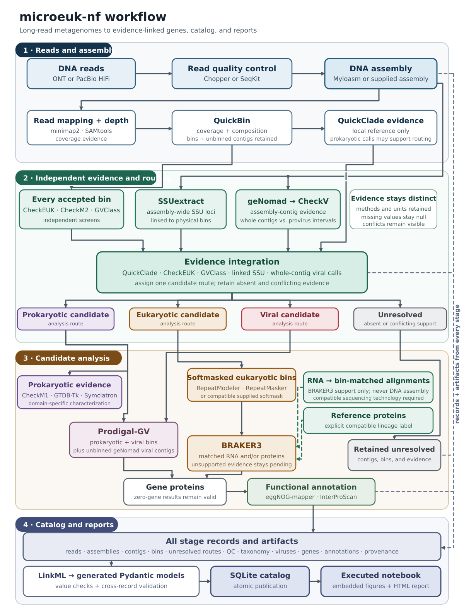

# microeuk-nf

microeuk-nf is a Nextflow workflow for ONT and PacBio HiFi metagenomes that
contain microbial eukaryotes, bacteria, archaea, and viruses. It performs read
QC, assembly, binning, independent quality and taxonomy analyses, and optional
gene calling and functional annotation. Quality, taxonomy, RNA, and protein
evidence determine the gene-calling branches. The workflow writes a validated SQLite
catalog, an executed notebook, and an HTML report.



*Candidate routes guide downstream analysis; they are not final taxonomy or
accepted MAG labels.*

The publication name is `microeuk-nf`. Established internal identifiers remain
`protist-meta-nf` for the Nextflow and Pixi workspaces, `protist-meta` for the
CLI, `protist_meta` for the Python package, and `protist-meta.sqlite` for the
catalog filename.

## Clone and prepare

```bash
git clone git@github.com:nelli-team/microeuk-nf.git
cd microeuk-nf
```

The clone is not a standalone full installation. `conf/databases.yaml` points to
local reference databases, sibling Pixi workspaces for CheckM1, CheckM2,
GTDB-Tk, Symclatron, geNomad, and CheckV, and application workspaces for
CheckEUK, GVClass, and SSUextract. Configure those paths for the target Dori
filesystem before a full run. The repository installers also retain fixed local
eggNOG and InterProScan setup paths.

Follow [Run and resume on Dori](docs/how-to/run-on-dori.md) for the ordered
environment setup and submission commands. Copy
[`data/samples.example.tsv`](data/samples.example.tsv) to a file of your choice,
edit its single row, and keep all 13 columns. Input paths are resolved relative
to that copied sample sheet.

Both optional stages are enabled by default in full mode. Add
`--skip-annotation` to the allocation launcher to retain gene models without
functional annotation, or `--skip-gene-calling` to omit both stages. The catalog
and report record the disabled stages and their reasons.

## Documentation

- [Source-scoped validation](SUMMARY.md) records accepted runs and scientific
  limits.
- [Scientific design](docs/explanation/design.md) explains the evidence and
  routing rules.
- [Input and dependency contract](docs/reference/inputs.md) defines the sample
  fields and local dependency boundary.
- [Report API](docs/reference/report.md) describes catalog reporting and
  interpretation.

Generated run outputs, validation receipts, and working notes are local
artifacts excluded from Git. The repository contains the reviewed source and
documentation; it does not claim a hosted documentation site.
